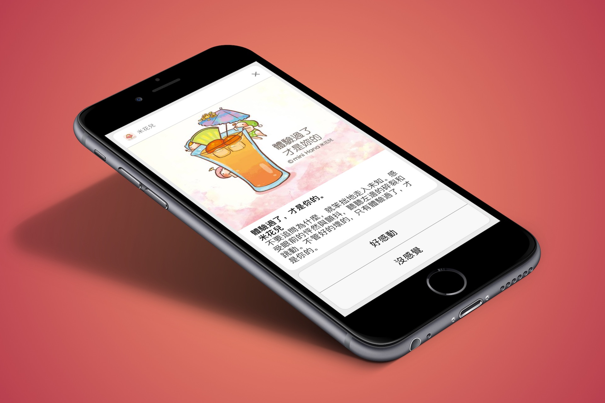

# A simple demo of UserNotifications Framework in iOS 10

In iOS 10, Apple introduces a new framework called UserNotifications. If you want to learn about how this demo was built, you can refer to the tutorial below, written by Peter (in Chinese):

結合 iOS 10 的 User Notifications：傳送米花兒的幸福打氣通知

http://www.appcoda.com.tw/ios10-user-notifications/
